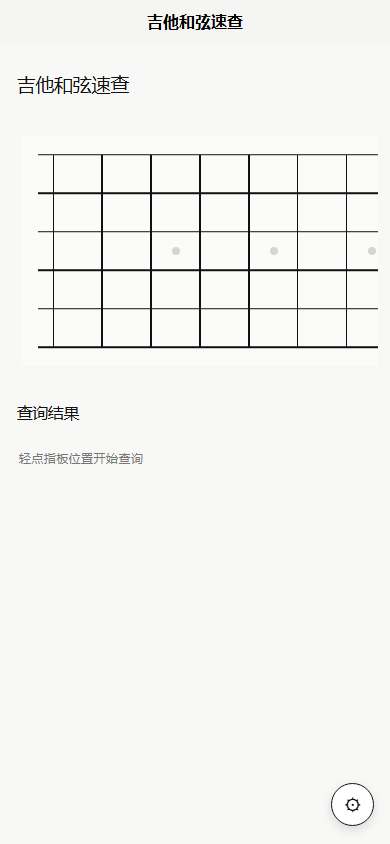

# 吉他和弦速查

一个面向吉他初学者的极简 uni-app 微信小程序：点击指板上的弦位，快速查询单音和常见和弦。



## 当前进度

- 小程序名称：吉他和弦速查。
- 微信小程序 AppID：`wx18da32459ef183ca`，已写入 `src/manifest.json` 的 `mp-weixin.appid`。
- 备案状态：已完成备案提交，等待微信/管局审核通过后再发布线上版本。
- 当前版本：`1.0.0`，核心功能已完成，面向微信小程序 `mp-weixin` 构建发布。
- 上线前建议执行：`npm.cmd run test`、`npm.cmd run type-check`、`npm.cmd run build:mp-weixin`。

## 特性

- 极简横向指板：只保留 6 根弦、品丝和轻量品位标记。
- 单音查询：选中一个弦位后显示对应音名。
- 和弦识别：选中多个音后匹配常见和弦，并显示中文解释和组成音。
- 初学者友好：内置和弦讲解，解释三和弦、挂和弦、七和弦、转位等概念。
- 调弦支持：内置 Standard、Drop D、半音降、DADGAD、Open G。
- 自定义空弦音：支持修改 6 根弦空弦音，并通过本地缓存保存。
- 纯前端离线：无登录、无后端、无网络请求。

## 技术栈

- [uni-app](https://uniapp.dcloud.net.cn/)
- Vue 3
- TypeScript
- Vite
- Vitest
- 微信小程序 `mp-weixin`

## 核心思路

指板音名使用 12 平均律 pitch class 计算：

```ts
note = (openStringPitch + fret) % 12
```

和弦识别采用本地模板匹配：

1. 收集用户选中的弦位。
2. 转换为唯一音高集合。
3. 遍历 12 个根音和常见和弦模板。
4. 优先返回完全匹配，少量返回缺五音、转位等常见候选。

目前覆盖：

- 大三和弦、小三和弦
- 减和弦、增和弦
- 五和弦
- 挂二、挂四
- 六和弦
- 属七、大七、小七、半减七
- add9
- slash chord，例如 `C/E`

## 本地开发

Windows PowerShell 直接运行 `npm` 可能被执行策略拦截，建议使用 `npm.cmd`。

```powershell
npm.cmd install
npm.cmd run dev:h5
```

浏览器预览：

```text
http://127.0.0.1:5173/
```

## 微信小程序开发

生成微信开发包：

```powershell
npm.cmd run dev:mp-weixin
```

然后在微信开发者工具中导入：

```text
dist/dev/mp-weixin
```

发布构建：

```powershell
npm.cmd run build:mp-weixin
```

然后导入并上传：

```text
dist/build/mp-weixin
```

当前微信小程序 AppID 已配置为：

```json
{
  "mp-weixin": {
    "appid": "wx18da32459ef183ca"
  }
}
```

上线流程：

1. 等待小程序备案状态变为已备案或备案成功。
2. 执行 `npm.cmd run test` 和 `npm.cmd run type-check`，确认测试与类型检查通过。
3. 执行 `npm.cmd run build:mp-weixin` 生成发布包。
4. 在微信开发者工具中导入 `dist/build/mp-weixin`，使用 AppID `wx18da32459ef183ca`。
5. 真机预览检查指板点击、单音查询、和弦识别、调弦切换和本地设置保存。
6. 在微信开发者工具上传代码，建议版本号填写 `1.0.0`。
7. 到微信公众平台版本管理中提交代码审核。
8. 代码审核通过且备案完成后，在微信公众平台手动发布线上版本。

## 测试

```powershell
npm.cmd run test
npm.cmd run type-check
npm.cmd run build:mp-weixin
```

测试覆盖：

- 标准调弦和 Drop D 音名计算。
- 每根弦单选逻辑。
- 常见和弦识别：C、G、D、A、E、F、Am、Em、Dm、G7、Cmaj7、Bm7b5。
- 中文和弦标签。
- 组成音输出。
- 本地设置持久化。

## 项目结构

```text
src/
  components/              # 指板、结果面板、设置面板
  composables/             # 指板状态和本地设置
  domain/music/            # 乐理、调弦、和弦识别
  pages/index/index.vue    # 主页面
```

## 隐私说明

当前版本不登录、不上传、不请求网络。小程序仅在本地保存调弦、弦序、是否显示开放音、是否看过首次提示等设置。

## License

[MIT](LICENSE)
